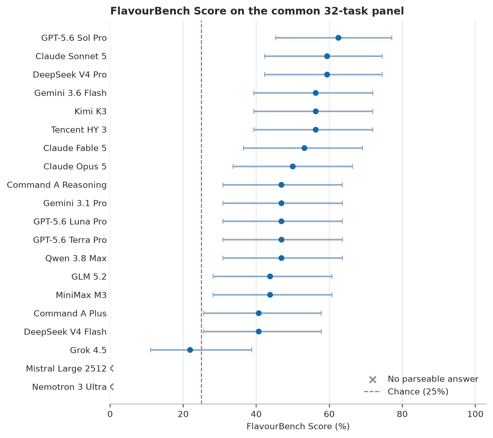

<div align="center">

# FlavourBench

### Executable culinary reasoning across frontier language models, without a model judge

**20 models · 32 tasks · 640 matched pairs · exact offline replay**

[Paper](paper/build/flavourbench.pdf) · [Leaderboard](https://huggingface.co/spaces/josefchen/flavourbench) · [Dataset](https://huggingface.co/datasets/josefchen/flavourbench) · [Reproduce](#reproduce-the-result)

</div>

FlavourBench is an executable benchmark of culinary reasoning across 20 current language-model
endpoints. Every model answers the same 32 exact-choice tasks. Model-only accuracy produces the
ranked **FlavourBench Score**. A matched run with one specified **Epicure** operation is retained as
a secondary integration diagnostic and never changes rank.

> **Current release:** a complete public automated benchmark for Epicure-grounded culinary reasoning. It does not claim to rank general intelligence.

## The result at a glance

| Release fact | Value |
|---|---:|
| Models | 20 |
| Culinary task families | 4 |
| Tasks | 32 |
| Matched model/Epicure pairs | 640 |
| Assigned arms | 1,280 |
| Observed response arms | 1,195 |
| Top FlavourBench Score | 62.5% (20/32) |
| Leader Wilson 95% interval | 45.3% to 77.1% |

The public panel includes GPT-5.6 Sol, Terra, and Luna; Claude Fable, Sonnet, and Opus 5; Gemini; Kimi K3; Qwen3.8 Max; GLM 5.2; both Cohere Command A routes; DeepSeek; MiniMax; Grok; Mistral; Nemotron; and Tencent HY3.

The **FlavourBench Score** is exact-choice model-only accuracy over all 32 tasks. Missing or
unparseable answers score zero, while parsed-answer count remains visible in a separate column.
Equal scores share a score rank.
The leading intervals overlap, so this release is an exact snapshot rather than a definitive
fine-grained ordering of general culinary ability.



## Why this benchmark is different

- **One ranking metric.** The public table uses only exact model-only accuracy.
- **Deterministic ground truth.** Each answer is derived from a fixed Epicure operation and a content-addressed result.
- **Matched diagnostic.** The assisted condition exposes tool-call and answer-contract failures without affecting rank.
- **Inspectability.** Public records include prompts, choices, answers, bounded Epicure traces, response times, routes, and hashes.
- **Failure visibility.** Missing or malformed endpoint responses stay distinguishable from wrong answers.
- **One-command replay.** The leaderboard is reconstructed from the release artifact, not copied from a dashboard.

## Reproduce the result

Python 3.12 is required.

```bash
git clone https://github.com/josefchen/flavourbench.git
cd flavourbench
python3.12 -m venv .venv
. .venv/bin/activate
pip install -e '.[dev]'

python -I paper/reproduce_epicure_native.py \
  --release paper/generated/epicure-native/epicure-native-release.json

pytest -q tests/epicure_native_taskset_test.py
make -C paper verify
```

Verify the distributed PDF and arXiv source bundle:

```bash
cd paper/build
sha256sum --check ARTIFACTS.sha256
```

The replay performs semantic and content-hash checks before reporting the leaderboard. It makes no provider calls.

## Repository map

| Path | What it contains |
|---|---|
| [`src/flavourbench`](src/flavourbench) | Benchmark, scoring, routing, release, and service code |
| [`tests`](tests) | Reproducibility, statistics, route, migration, and release tests |
| [`paper`](paper) | Manuscript source, final PDF, arXiv bundle, figures, and exact release |
| [`data/season0`](data/season0) | Public frozen and curated benchmark inputs |
| [`hf/space`](hf/space) | Self-contained Hugging Face Space prototype |
| [`hf/dataset`](hf/dataset) | Dataset card, exporter, and public table configs |
| [`docs/huggingface-space-plan.md`](docs/huggingface-space-plan.md) | Product and visual direction for the public explorer |

## Hugging Face launch direction

The Space is an evidence explorer, not another spreadsheet leaderboard. Its center of gravity is a **Pair Lens**: select any model and task, then inspect the Model only answer, Model + Epicure answer, Epicure operation, bounded trace, correctness, timing, and provenance together. The dataset is split into explicit tables for tasks, models, observations, paired outcomes, and leaderboard rows.

The launch files in [`hf`](hf) are intentionally provider-free. They read the checked-in release and make no model or Epicure calls.

## Research boundaries

The 32-task release is deliberately inspectable. One correct answer moves a model by 3.125 points,
so close scores should be read with the reported intervals and task-level matrix. Exact paired tests
do not separate the 20/32 leader from either 19/32 runner-up. After Holm adjustment, only three of
19 leader comparisons separate, and two are DNF endpoints. Nemotron's zero reflects endpoint
availability in this run, not a claim that the underlying model has zero culinary capability. The
assisted condition uses a named operation and is an execution diagnostic, not a second leaderboard.

## Citation

Citation metadata will be updated with the arXiv identifier. Until then, cite the repository and the exact release artifact SHA recorded in [`epicure-native-release.json`](paper/generated/epicure-native/epicure-native-release.json).

## Licensing and data rights

The manuscript, original figures, benchmark tasks, and authored metadata are CC BY 4.0. Model responses and third-party names retain the rights boundaries described in [`LICENSES.md`](LICENSES.md). The software does not yet carry a general open-source grant; a software license must be selected before representing this repository as open source.

## Security

No provider credentials, private databases, local runtime evidence, or unrestricted Epicure payloads belong in this repository. See [`SECURITY.md`](SECURITY.md) for reporting and handling guidance.
