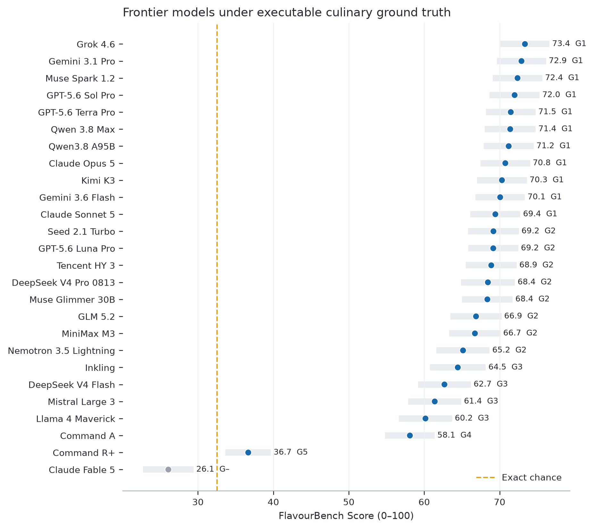

<div align="center">

# FlavourBench

### Ranking frontier language models with executable culinary ground truth

**Josef Chen** — Independent Researcher · **Jakub Radzikowski** — Independent Researcher · **Erim Hayretci** — Independent Researcher

**26 models · 640 tasks · 16,640 primary responses · 1,664 repeats · 325 paired tests**

[Paper](paper/build/flavourbench.pdf) · [Leaderboard](https://huggingface.co/spaces/josefchen/flavourbench) · [Dataset](https://huggingface.co/datasets/josefchen/flavourbench) · [Reproduce](#reproduce-the-release)

</div>

FlavourBench is an automated benchmark for culinary reasoning. Every model solves the same 640
three-of-eight ingredient-selection tasks. Before model execution, a versioned Epicure runtime
scores all 56 possible portfolios for each task, producing a fixed continuous reward surface.
Models never see Epicure at inference time, and no language model or human grades their answers.

The public release covers current frontier systems from OpenAI, Anthropic, Google, xAI, Alibaba,
Moonshot, Zhipu, DeepSeek, Meta, ByteDance, Thinking Machines, MiniMax, NVIDIA, Mistral, Tencent,
and Cohere. It ships the complete
response grid, repeat panel, route identities, statistical analysis, paper, and provider-free
reproduction path.

## Result

Grok 4.6 has the highest point estimate at **73.36**, followed by Gemini 3.1 Pro Preview at
**72.90** and Muse Spark 1.2 at **72.38**. The leading confidence bands overlap, so the release
reports both point ranks and statistical rank groups instead of manufacturing a unique winner.

| Rank | Model | FlavourBench Score | Simultaneous 95% band | Group | Repeat agreement |
|---:|---|---:|---:|:---:|---:|
| 1 | Grok 4.6 | 73.36 | 70.10–76.62 | 1 | 77.8% |
| 2 | Gemini 3.1 Pro Preview | 72.90 | 69.63–76.17 | 1 | 80.8% |
| 3 | Muse Spark 1.2 | 72.38 | 69.07–75.68 | 1 | 83.4% |
| 4 | GPT-5.6 Sol Pro | 71.99 | 68.67–75.31 | 1 | 86.2% |
| 5 | GPT-5.6 Terra Pro | 71.48 | 68.19–74.78 | 1 | 79.8% |
| 6 | Qwen3.8 Max | 71.41 | 68.02–74.79 | 1 | 79.5% |
| 7 | Qwen3.8 2.4T A95B | 71.20 | 67.88–74.53 | 1 | 78.1% |
| 8 | Claude Opus 5 | 70.76 | 67.47–74.04 | 1 | 74.8% |
| 9 | Kimi K3 | 70.31 | 67.00–73.62 | 1 | 74.2% |
| 10 | Gemini 3.6 Flash | 70.07 | 66.79–73.36 | 1 | 79.5% |
| 11 | Claude Sonnet 5 | 69.44 | 66.11–72.76 | 1 | 79.1% |
| 12 | Seed 2.1 Turbo | 69.18 | 65.81–72.55 | 2 | 82.2% |
| 13 | GPT-5.6 Luna Pro | 69.16 | 65.84–72.48 | 2 | 71.9% |
| 14 | Hy3 | 68.89 | 65.52–72.26 | 2 | 52.0% |
| 15 | DeepSeek V4 Pro 0813 | 68.45 | 64.86–72.04 | 2 | 66.2% |
| 16 | Muse Glimmer 30B | 68.38 | 65.02–71.74 | 2 | 79.5% |
| 17 | GLM 5.2 | 66.88 | 63.49–70.26 | 2 | 66.6% |
| 18 | MiniMax M3 | 66.73 | 63.32–70.13 | 2 | 70.5% |
| 19 | Nemotron 3.5 Lightning | 65.15 | 61.62–68.68 | 2 | 75.6% |
| 20 | Inkling | 64.46 | 60.75–68.17 | 3 | 65.2% |
| 21 | DeepSeek V4 Flash 0731 | 62.69 | 59.17–66.20 | 3 | 55.8% |
| 22 | Mistral Large 3 2512 | 61.40 | 57.88–64.92 | 3 | 64.1% |
| 23 | Llama 4 Maverick | 60.17 | 56.63–63.71 | 3 | 52.7% |
| 24 | Cohere Command A | 58.11 | 54.82–61.40 | 4 | 57.2% |
| 25 | Cohere Command R+ (08-2024) | 36.67 | 33.66–39.69 | 5 | 23.0% |
| DNF | Claude Fable 5 | 42.32 | 37.88–46.76 | — | 48.4% |

Twenty-five systems meet the preregistered eligibility floor and all 25 score above the taskwise
exact-chance baseline after Holm correction. Claude Fable 5 is retained as an intention-to-evaluate
DNF because only 413 of 640 primary responses completed, although its failure-adjusted score is
itself significantly above chance. **143 of 300** eligible-model contrasts and **167 of 325** total
prespecified contrasts remain significant after multiplicity correction. Scores use 50,000
family-stratified shared-task bootstrap replicates;
pairwise tests use 100,000 shared-task sign flips. Label-permuted repeats measure response stability.

Fable's 42.32 is an operational, failure-adjusted score—not a clean estimate of completed-answer
quality. Its provider ledger records 227 primary refusals, including 139/160 regional-composition
tasks. On completed cells, its equal-family descriptive mean is 73.05 (65.58 without family
reweighting). Because those omissions are strongly non-random, neither complete-case value is used
for ranking; the release reports Fable as DNF rather than as the worst model.



## What the score means

For each task, Epicure assigns a utility to every legal three-ingredient portfolio. The model's
chosen portfolio is placed on a 0–100 task scale between the task's worst and best portfolio. The
**FlavourBench Score** is the equal-family mean across substitution, pairing, dietary constraints,
and regional composition. Invalid, failed, or unparseable responses remain in the denominator at
zero.

Epicure is the executable environment, not a contestant. A score of 100 means that a model selected
Epicure's optimum on every task; it does not mean that Epicure was awarded 100% by itself. The
benchmark measures decision quality against a published, versioned culinary reward surface.

## Why it is useful

- **Dense, deterministic supervision.** Every task has 56 scored actions, not one brittle answer key.
- **No judge-model circularity.** The leaderboard does not depend on another LLM's preferences.
- **Common-task inference.** Models are compared on the same tasks with paired uncertainty.
- **Modern routes.** Qwen3.8 Max, Kimi K3, Cohere Command A, GPT-5.6 Sol/Terra/Luna, and the rest of
  the panel are measured in the same clean lineage with provider fallback disabled.
- **Training-ready rewards.** The exhaustive action maps support reward modeling, reranking, search,
  and held-out reinforcement-learning experiments without leaking the public test set.
- **Auditability.** Prompts, candidate sets, scores, raw responses, failures, routes, seeds, and
  content hashes are distributed as explicit tables.

## Reproduce the release

Python 3.12 is recommended. The compact statistical release is checked into GitHub and verifies
without network access:

```bash
git clone https://github.com/josefchen/flavourbench.git
cd flavourbench
python3.12 -m venv .venv
. .venv/bin/activate
pip install -e '.[dev]'

python3 -I paper/reproduce_powered_release.py \
  --release paper/generated/powered/flavourbench-powered-release-d4d2d65eddea8c324028f2fcad0c14361a8cee87f8a953cede9babaeba75be9c.json

make -C paper -f Makefile.powered arxiv
cd paper/build && sha256sum --check ARTIFACTS.sha256
```

To reconstruct the release from every raw response, download the larger evidence layer from
Hugging Face and restore the five content-addressed run directories:

```bash
hf download josefchen/flavourbench --repo-type dataset \
  --include 'data-powered/*' --local-dir hf-release

python3 -I hf/dataset/restore_powered_runs.py \
  --release paper/generated/powered/flavourbench-powered-release-d4d2d65eddea8c324028f2fcad0c14361a8cee87f8a953cede9babaeba75be9c.json \
  --primary hf-release/data-powered/primary_observations.jsonl \
  --repeat hf-release/data-powered/repeat_observations.jsonl \
  --base-run benchmark/powered-v31/run \
  --cohere-run benchmark/powered-v35/run \
  --frontier-run benchmark/powered-v38/run \
  --deepseek-run benchmark/powered-v39/run \
  --successor-run benchmark/powered-v42/run

make -C paper -f Makefile.powered analysis assets arxiv
```

The restore path validates the complete 16,640 + 1,664 grid and refuses conflicts. No reproduction
command calls a model provider.

## Repository map

| Path | Contents |
|---|---|
| [`src/flavourbench`](src/flavourbench) | Task construction, route contracts, runners, scoring, and inference |
| [`benchmark`](benchmark) | Content-addressed task sets, plans, manifests, and compact run evidence |
| [`paper`](paper) | Manuscript, generated tables and figures, final PDF, and arXiv source tarball |
| [`hf/dataset`](hf/dataset) | Six-table Hugging Face dataset exporter and strict run restorer |
| [`hf/space`](hf/space) | Interactive evidence explorer and compact verified bundle |
| [`tests`](tests) | Statistical, route, integrity, reproduction, and publication tests |

## Scientific scope

FlavourBench ranks models on constrained culinary selection under the released Epicure reward
surface. It is not a universal intelligence, food-safety, sensory-quality, or full-recipe benchmark.
Endpoint results bind the exact routes and collection period in the release. The paper reports
unresolved top groups where the data do not support a sharper claim.

## Citation

The arXiv identifier will be added after submission. Until then, cite the paper and powered release
`d4d2d65eddea8c324028f2fcad0c14361a8cee87f8a953cede9babaeba75be9c`:

```bibtex
@article{chen2026flavourbench,
  title   = {FlavourBench: Ranking Frontier Language Models with Executable Culinary Ground Truth},
  author  = {Chen, Josef and Radzikowski, Jakub and Hayretci, Erim},
  year    = {2026}
}
```

## Licensing and security

Benchmark prompts, choices, identifiers, authored metadata, derived tables, and original figures
are CC BY 4.0. Model responses retain the provider and research-use boundaries in
[`LICENSES.md`](LICENSES.md). Credentials, private databases, and unrestricted Epicure source data
must never be committed; see [`SECURITY.md`](SECURITY.md).
