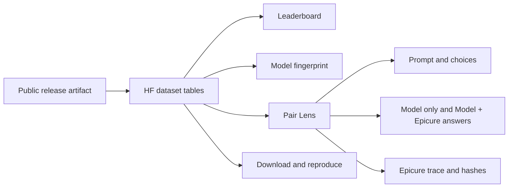

# FlavourBench on Hugging Face

## Product thesis

Most benchmark Spaces begin with a dense sortable table. FlavourBench should begin with its
scientific advantage: a matched Model only/Model + Epicure observation for every model-task cell. The first
screen should communicate one idea in under five seconds:

> Blue is what the model knew alone. Gold is what Epicure added.

The public product is an evidence explorer with a leaderboard, not a leaderboard with an About
tab attached.

## Competitive scan

The design takes current patterns from several successful Hugging Face benchmark products while
avoiding a visual clone.

| Space | Useful pattern | FlavourBench response |
|---|---|---|
| [Open LLM Leaderboard](https://huggingface.co/spaces/open-llm-leaderboard/open_llm_leaderboard) | Filters, selectable columns, comparison workflow, separate result datasets | Keep filtering and comparison, but make matched evidence the primary interaction |
| [MTEB Leaderboard](https://huggingface.co/spaces/mteb/leaderboard) | Focused full-width product and a disciplined information hierarchy | Use a similarly restrained research-product shell |
| [LMArena Leaderboard](https://huggingface.co/spaces/lmarena-ai/arena-leaderboard) | Strong first-screen identity and fast access to current results | Lead with one memorable visual instead of instructions |
| [GAIA Leaderboard](https://huggingface.co/spaces/gaia-benchmark/leaderboard) | Clear method, citation, dataset, and submission surfaces | Put method and reproduction next to the evidence |
| [BigCode Leaderboard](https://huggingface.co/spaces/bigcode/bigcode-models-leaderboard) | Searchable table, plots, and explicit submission path | Add search now and a governed submission flow later |
| [LLM Performance Leaderboard](https://huggingface.co/spaces/optimum/llm-perf-leaderboard) | Goal-oriented model finder and useful plot tabs | Later add task-family and availability-aware model discovery |

Hugging Face's current [leaderboard documentation](https://huggingface.co/docs/leaderboards/main/index)
also supports a dataset-backed architecture. The Space and dataset should be independent repos,
with the Space consuming an immutable dataset revision.

## Experience architecture

### 1. Evidence hero

A real FlavourBench Score plus Epicure Gain rail plot fills the right half of the hero. It uses the checked-in data,
not a product mockup. Four compact facts establish scale without a row of generic cards.

### 2. Leaderboard

The table exposes rank, model, FlavourBench Score, Model + Epicure accuracy, Epicure Gain, observed-arm count, and route.
Availability is never collapsed into a capability claim. Tied and near-tied pilot scores should
eventually appear as visual rank groups.

### 3. Model fingerprint

Selecting a model reveals its four-family profile. The future version should add a small-multiple
heatmap and a response-availability strip, not a decorative radar chart.

### 4. Pair Lens

This is the signature interaction. A researcher selects a model and task and sees:

- the exact prompt and choices;
- Model only and Model + Epicure answers side by side;
- observed choice and correctness;
- latency and response artifact hash;
- bounded Epicure tool trace;
- reference operation, reference result, and result hash; and
- release provenance.

Every visible number should be openable into evidence.

### 5. Method and download

The final tab defines the score in plain language, links the repository and paper, identifies the
release hash, and gives one exact replay command.

## Visual system

The visual language is an editorial scientific instrument, not an AI startup landing page.

| Token | Value | Role |
|---|---|---|
| FlavourBench Blue | `#1769AA` | Primary action, baseline score, focus state |
| Epicure Gold | `#E6A11A` | Tool-added portion of paired results |
| Evidence Teal | `#168C7A` | Correct and verified states |
| Failure Red | `#C75450` | Incorrect or failed states only |
| Charcoal | `#262B33` | Primary text |
| Paper | `#F7F8FA` | Light canvas |

Use Geist or Inter for interface copy and IBM Plex Mono for hashes and measurements. The layout
uses thin rules, 8-pixel panel radii, broad editorial whitespace, and restrained motion only when
the selected model or task changes. Dark mode is first-class. Reduced-motion preferences disable
all nonessential transitions.

## Dataset architecture

The companion dataset exposes five first-class configurations:

1. `models`: route identity plus summary metrics;
2. `tasks`: prompt, choices, expected answer, family, and Epicure reference;
3. `observations`: all 1,280 assigned arms, including unavailable responses;
4. `paired_outcomes`: 640 matched model-task comparisons; and
5. `leaderboard`: one flattened summary row per model.

JSON Lines makes the launch auditable. Parquet should be added for the public dataset once the
component-level license is finalized. The Data Viewer should remain enabled for every config.

## Launch sequence

### Phase 1: public preview

- Publish `josefchen/flavourbench` on GitHub.
- Select a software license and confirm the dataset component license.
- Create `josefchen/flavourbench` as a Hugging Face dataset repository.
- Upload `hf/dataset/README.md` and `hf/dataset/data`.
- Create `josefchen/flavourbench-explorer` as a Gradio Space.
- Upload the contents of `hf/space`.
- Pin the Space to the dataset's commit SHA before announcing it.

### Phase 2: research polish

- Add score-group and uncertainty visualization.
- Add model-vs-model comparison across all 32 tasks.
- Add family heatmap and failure decomposition.
- Add URL-deep-linked Pair Lens selections.
- Add downloadable citation, JSON, and Parquet links.
- Add an architecture figure explaining Epicure, not a generic system diagram.

### Phase 3: governed submissions

- Accept result artifacts, never provider keys.
- Validate schema, model identity, route, task-set hash, and missingness.
- Label submissions as author-run or independently reproduced.
- Keep the original public pilot immutable and publish later releases under new versions.

## Launch checklist

- [ ] Software license selected
- [ ] Dataset rights statement approved
- [ ] GitHub release tagged and checksums attached
- [ ] Dataset repository created and commit pinned
- [ ] Space repository created and dataset revision pinned
- [ ] Pair Lens verified against at least five hand-checked records
- [ ] Mobile, dark-mode, keyboard, and reduced-motion checks complete
- [ ] Model availability failures clearly labeled
- [ ] Paper and dataset cite the same release artifact SHA
- [ ] No secret, local path, private evidence, or unrestricted Epicure payload in either repo
