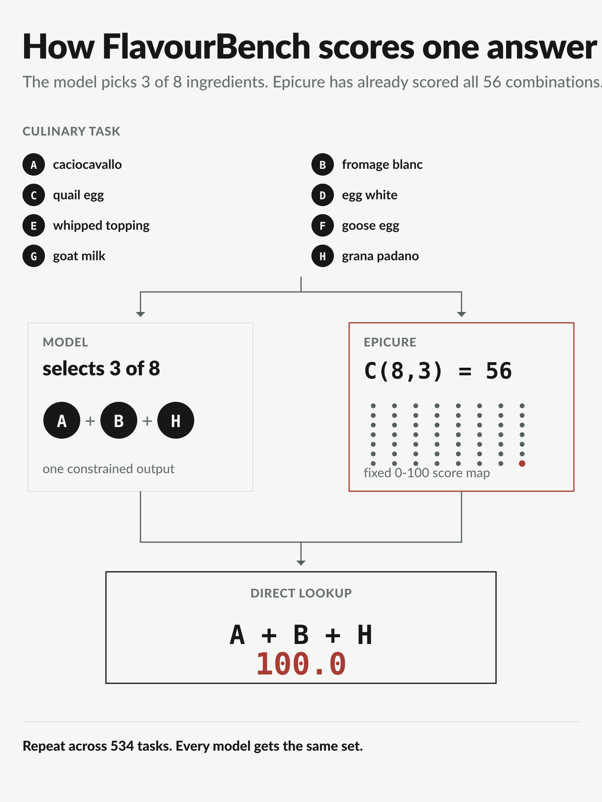
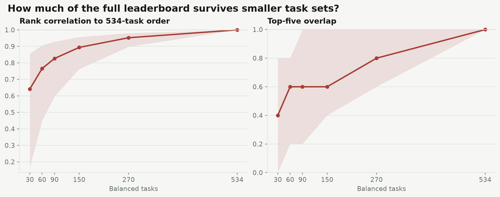

# FlavourBench


**An executable culinary benchmark for frontier language models.** Pick 3 ingredients from 8.
Epicure scores all 56 legal portfolios before a model runs. One response becomes one deterministic
score from 0 to 100. Repeat across 534 shared tasks.

[Open the leaderboard](https://huggingface.co/spaces/josefchen/flavourbench)&nbsp;&nbsp;&nbsp;
[Read the paper](https://arxiv.org/abs/2608.20574)&nbsp;&nbsp;&nbsp;
[Run the source](https://github.com/josefchen/flavourbench)&nbsp;&nbsp;&nbsp;
[Submit a result](https://github.com/josefchen/flavourbench/issues/new?template=flavourbench-result.yml)

Josef Chen, Independent Researcher<br>
Erim Hayretci, Imperial College London

## The release in one screen

| | Count | What is held constant |
|---|---:|---|
| Frontier endpoints | **27** | The exact 534-task prompt set |
| Shared tasks | **534** | 178 substitution, 178 pairing, 178 constraint |
| Scored answers | **14,418** | One valid answer in every model-task cell |
| Model pairs | **351** | Shared-task contrasts with familywise error control |

The point-estimate leader is **Grok 4.6 at 65.07**, followed by Gemini 3.1 Pro Preview at 64.95
and GPT-5.6 Sol Pro at 64.23. The release resolves 101 of 351 model pairs after Holm correction.
The leading simultaneous intervals overlap, so the leaderboard reports the point order and the
statistical groups together.

## Run it on your model

The same runner handles an OpenAI-compatible endpoint, vLLM server, or local Transformers
checkpoint. It fetches the official task file from this dataset, checkpoints every answer, resumes
interrupted runs, and emits a content-addressed report.

### Hosted endpoint

```bash
python -m pip install "epicure-flavourbench @ git+https://github.com/josefchen/flavourbench.git"

export LAB_MODEL_API_KEY='...'
flavourbench run \
  --backend openai-compatible \
  --base-url https://your-endpoint.example/v1 \
  --api-key-env LAB_MODEL_API_KEY \
  --model your-exact-model-id \
  --responses responses.jsonl \
  --report flavourbench-report.json \
  --resume
```

### Local checkpoint

```bash
python -m pip install "epicure-flavourbench[transformers] @ git+https://github.com/josefchen/flavourbench.git"

flavourbench run \
  --backend transformers \
  --model /path/to/checkpoint \
  --responses responses.jsonl \
  --report flavourbench-report.json \
  --resume
```

Add `--limit 12` to either command for a balanced smoke test. Remove it for the complete 534-task
run. The CLI never stores a provider key. A complete run receives a FlavourBench Score and a 95%
cluster-bootstrap interval. Partial runs receive coverage diagnostics and no comparable headline
score.

You can also upload the response artifact in the
[Space](https://huggingface.co/spaces/josefchen/flavourbench), or call its named
`score_completion`, `score_submission`, and `training_reward` endpoints.

## Publish a verified result

A leaderboard submission includes the complete 534-response artifact, the content-addressed
score report, exact model and route identifiers, decoding settings, and a training-data
disclosure. The maintainer reruns the offline verifier before a result can enter a new versioned
release. Provider keys and model weights are never submitted.

[Read the submission contract](https://github.com/josefchen/flavourbench/blob/main/docs/submitting-results.md)
or [open a result submission](https://github.com/josefchen/flavourbench/issues/new?template=flavourbench-result.yml).

## Train against the reward, not the test set



The lab track contains **426 anchor-disjoint reward maps**: 270 for training, 72 for validation,
and 84 for a predeclared transfer evaluation. None of their ingredient anchors occurs in the
534-task leaderboard. The evaluation maps are public, not secret, but optimizer-facing configs do
not load them. The three training views support different setups:

| Config | Training signal | Rows |
|---|---|---:|
| `sft` | Optimal prompt-completion demonstrations plus optimum margins | 270 train + 72 validation |
| `dpo` | Four deterministic chosen/rejected pairs per task | 1,080 train + 288 validation |
| `grpo` | The complete dense 56-choice reward map for each prompt | 270 train + 72 validation |
| `lab_tasks/test` | Predeclared, balanced transfer evaluation | 84 |

```python
from datasets import load_dataset

sft = load_dataset("josefchen/flavourbench", "sft")
dpo = load_dataset("josefchen/flavourbench", "dpo")
grpo = load_dataset("josefchen/flavourbench", "grpo")
```

The [runnable SFT, DPO, and GRPO recipes](https://github.com/josefchen/flavourbench/tree/main/examples/lab)
work locally or as Hugging Face Jobs. Each pushes the trained adapter to the model owner's Hub
account and records metrics with Trackio. GRPO computes rewards locally, so a rollout does not need
one Space request per sample.

The [prospective reward-transfer protocol](https://github.com/josefchen/flavourbench/blob/main/docs/reward-transfer-study.md)
freezes the two base checkpoints, three methods, three seeds, six confirmatory contrasts, and the
held-out inference rules before training begins.

## What the score means

For task \(t\), Epicure assigns a value to each of the 56 legal three-item portfolios. The chosen
portfolio is min-max normalized within that task to a score from 0 to 100. FlavourBench then takes
the equal-weight mean of the three task-family means:

\[
\mathrm{FB}(m) = \frac{1}{3}\sum_{f \in \{S,P,C\}}
\frac{1}{|T_f|}\sum_{t \in T_f} s_{m,t}.
\]

A score of **100** means choosing Epicure's optimum on every task. Epicure is the executable
reference environment, not a ranked model. The random-choice baseline is calculated exactly by
averaging all 56 legal portfolios on each task, rather than estimating chance from simulations.

Inference uses 534 ingredient-anchor clusters, 50,000 shared cluster-bootstrap replicates,
simultaneous 95% score intervals, 100,000 cluster sign flips for all model pairs, Holm correction,
and bootstrap rank intervals. Shared tasks move together in every resample.

The crossed 27-by-534 design has a descriptive relative-decision generalizability coefficient of
**0.936**; its estimated threshold for 0.90 is 329 balanced tasks. In 5,000 score-blind,
family-by-panel stratified subsamples of 270 tasks, the median rank correlation with the full point
order is **0.952** (empirical 95% range 0.897–0.980). The point leader is preserved in only 46.1%
of those half-size subsets, which is why FlavourBench publishes rank uncertainty instead of
declaring every adjacent point rank definitive.



## Dataset views

| Config | Rows | Unit |
|---|---:|---|
| `models` | 27 | Score, uncertainty, route, family scores, and panel replication |
| `tasks` | 534 | Prompt, candidates, all 56 Epicure scores, family, anchor, and panel |
| `primary_observations` | 14,418 | One content-addressed response for each model-task cell |
| `leaderboard` | 27 | Point rank, statistical group, score interval, and route |
| `pairwise_comparisons` | 351 | Paired difference, sign-flip test, Holm result, and effect size |
| `task_count_stability` | 6 | Stratified task-count precision and rank-stability curve |
| `variance_partition` | 6 | Crossed model, task, family, panel, and interaction components |
| `lab_tasks` | 426 | Anchor-disjoint train, validation, and transfer-evaluation maps |
| `sft`, `dpo`, `grpo` | multiple | Ready-to-load training views |

The original two panels contained 640 tasks each. The release keeps parser-valid all-model tasks,
orders them by a score-blind hash rule, and takes 89 tasks per family from each panel. The resulting
common core has 267 tasks per panel and 534 tasks overall. Regional composition remains in the
development evidence but is not ranked because it could not supply the same balanced all-model
matrix.

## Reproduce and verify

`data-complete-core/DATA_MANIFEST.json` binds every release table by byte size and SHA-256.
`data-lab/DATA_MANIFEST.json` independently binds every training view.

```bash
git clone https://github.com/josefchen/flavourbench.git
cd flavourbench
python -m pip install -e '.[dev]'

python hf/dataset/build_lab_dataset.py --check
python3 -I hf/dataset/verify_complete_core_dataset.py \
  --dataset-directory hf/dataset/data-complete-core
pytest -q tests/lab_cli_test.py tests/hf_lab_space_api_test.py
```

These checks make no provider calls.

| Bound artifact | SHA-256 or semantic ID |
|---|---|
| Dataset manifest | `54331a825da40ab90c8e13fc971d47fe4eb94e5f23cf87ec70131fe5e3807e05` |
| Release semantic ID | `0a20655c97aa1363c2266e247f3dd03b759d0f80bca9154c6619c5549b2fac99` |
| Release file | `709452f8cf54ebc1947f2a3c24e6ee19580be1c115ba3a9effbac441de556db4` |
| Analysis plan | `2ba71c793c8d4b97eed863ee83fd770b429fdefdffebdeafb241672f634ee507` |
| Lab dataset | `257dfaf17c4f529f2f9b538c0c0b7d7d8ea030262f75ecf06284b61658a64137` |

## Rights and citation

Prompts, candidate sets, derived tables, and original figures are CC BY 4.0. Model responses retain
their provider terms. Epicure's underlying ingredient data and embeddings are not redistributed.
The evaluation and training software is Apache-2.0. See the repository
[rights boundary](https://github.com/josefchen/flavourbench/blob/main/LICENSES.md).

Josef Chen is a Cohere Labs Catalyst Grant recipient. This acknowledgement does not imply Cohere
endorsement of FlavourBench, Epicure, the protocol, or any model ranking.

```bibtex
@article{chen2026flavourbench,
  title  = {FlavourBench: Ranking Frontier Language Models with Executable Culinary Ground Truth},
  author = {Chen, Josef and Hayretci, Erim},
  journal = {arXiv preprint arXiv:2608.20574},
  year   = {2026},
  eprint = {2608.20574},
  archivePrefix = {arXiv},
  primaryClass = {cs.CL},
  url = {https://arxiv.org/abs/2608.20574}
}
```
