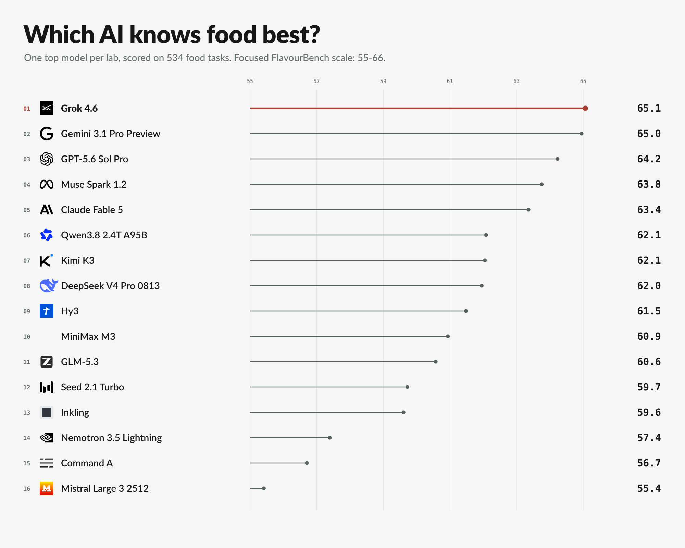

# FlavourBench



**Pick 3 ingredients from 8. Epicure scores all 56 legal portfolios first. Then every model faces
the same 534 decisions.**

The Space is both the public scorebook and a working benchmark interface:

- **Leaders** ranks all 27 endpoints with simultaneous intervals and statistical groups.
- **Insights** shows score bands, pairwise resolution, and task-family fingerprints.
- **Transfer** reports the controlled, three-seed Epicure supervision study and its public replication.
- **Profiles** breaks each score into substitution, pairing, and constraint performance.
- **Inspect** opens the exact prompt, answer, 56-choice score map, route, and content hashes.
- **Run your model** builds a copyable endpoint or local-checkpoint command, demonstrates one dense
  training reward, and scores a complete JSONL run.
- **Compare** queries any of the 351 shared-task pairwise contrasts.

No model judge runs behind the interface. The Space performs deterministic lookups against the
released reward maps and makes no model-provider calls.

The paper also reports a fixed-task sensitivity analysis with three immutable public Epicure
checkpoints. Model-rank correlations with the primary result range from 0.903 to 0.957. This tests
dependence on the released reward map; it is not a human taste validation.

A separate held-out Recipe1MSubs check asks whether those public checkpoints recover substitutions
observed in recipe-user comments. Across 1,469 unique mapped pairs, the observed target lands at
the 0.780--0.806 equal-source percentile among same-food-group alternatives; every
source-clustered interval clears the 0.5 chance level after Holm correction. Because Recipe1M is
upstream of part of Epicure's corpus, this is label-independent validation of substitution
geometry, not validation of the primary runtime, the full benchmark reward, or cooked outcomes.

The completed [reward-transfer study](https://github.com/josefchen/flavourbench/blob/main/docs/reward-transfer-study.md)
compares Epicure-optimum SFT with a prompt- and format-matched control over three seeds. On 84
predeclared, anchor-disjoint maps, Epicure SFT gains 13.30 points over control (95% CI 6.52 to
20.29; two-sided sign-flip p = 0.000170). The same adapters gain 11.73 points on the 534 public
maps (95% CI 8.98 to 14.54; p = 0.000010). Every generation, training manifest, evaluation
manifest, and analysis artifact is released in the linked dataset.

This establishes transfer to unseen Epicure maps beyond output-format learning. It does not test
human taste, general model quality, or reinforcement-learning improvement. The intervals resample
matched seeds and anchors; the p-values test held-out anchors conditional on the three realized
seed pairs.

## Run from your own environment

```bash
python -m pip install "epicure-flavourbench @ git+https://github.com/josefchen/flavourbench.git"

export LAB_MODEL_API_KEY='...'
flavourbench run \
  --backend openai-compatible \
  --base-url https://your-endpoint.example/v1 \
  --api-key-env LAB_MODEL_API_KEY \
  --model your-exact-model-id \
  --responses responses.jsonl \
  --report flavourbench-report.json \
  --resume
```

Add `--limit 12` for a balanced smoke test. The runner checkpoints each answer and resumes without
repeating completed calls. Credentials and model weights stay in your environment.

The accepted response contract is one JSON object per line:

```json
{"task_id":"...","status":"completed","response":"FINAL_SELECTION: A,B,C"}
```

A comparable score requires one valid answer for all 534 tasks. Partial runs still receive
per-task and coverage diagnostics. Uploads are never added to the official leaderboard
automatically.

Verified complete runs can be proposed through the
[result submission form](https://github.com/josefchen/flavourbench/issues/new?template=flavourbench-result.yml).
The [submission contract](https://github.com/josefchen/flavourbench/blob/main/docs/submitting-results.md)
lists the required response artifact, route metadata, settings, and training disclosure. Accepted
results enter a new versioned release; the published release is never edited in place.

## API and training

The Space exposes four named endpoints:

| Endpoint | Use |
|---|---|
| `/score_completion` | Score one completion on one official task |
| `/score_submission` | Score a complete JSON or JSONL artifact supplied as text |
| `/training_reward` | Query one of 342 anchor-disjoint train/validation reward maps |
| `/score_uploaded_submission` | Score an uploaded artifact and return a report |

Use **Use via API** in the running Space for generated Python, JavaScript, and curl clients. For
high-throughput RL, use the local deterministic reward function. The linked dataset includes
ready-to-load SFT, DPO, and GRPO views plus runnable LoRA recipes for Hugging Face Jobs.

The local verifier reconstructs all 4,326 released reward-transfer generations and both inferential
contrasts:

```bash
python experiments/reward_transfer/verify_release.py
```

[Dataset and lab kit](https://huggingface.co/datasets/josefchen/flavourbench)&nbsp;&nbsp;&nbsp;
[Paper](https://arxiv.org/abs/2608.20574)&nbsp;&nbsp;&nbsp;
[Source](https://github.com/josefchen/flavourbench)

Josef Chen, Independent Researcher<br>
Erim Hayretci, Imperial College London

```bibtex
@article{chen2026flavourbench,
  title  = {FlavourBench: Executable Culinary Reward Maps for Language Model Evaluation and Post-Training},
  author = {Chen, Josef and Hayretci, Erim},
  journal = {arXiv preprint arXiv:2608.20574},
  year   = {2026},
  eprint = {2608.20574},
  archivePrefix = {arXiv},
  primaryClass = {cs.CL},
  url = {https://arxiv.org/abs/2608.20574}
}
```
